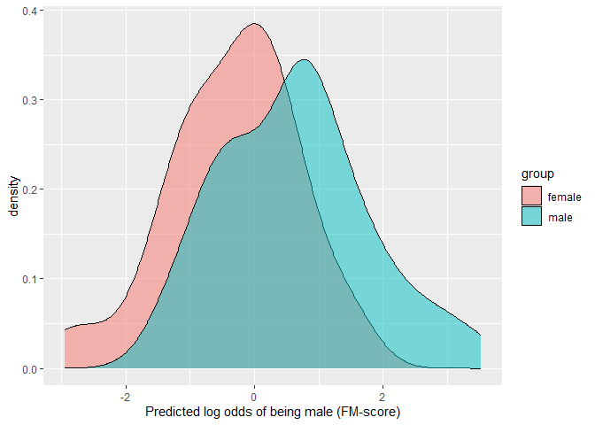
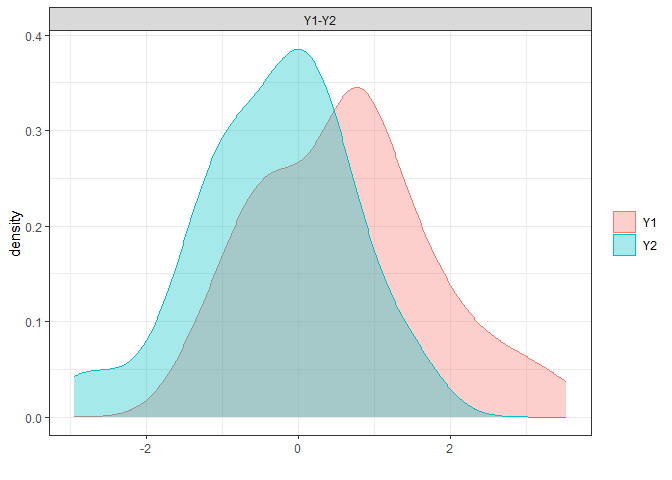

<!-- README.md is generated from README.Rmd. Please edit that file -->

# multid

<!-- badges: start -->

[](https://www.r-pkg.org/badges/version/multid)

[](https://cranlogs.r-pkg.org/badges/grand-total/multid)

<!-- badges: end -->

multid provides tools for regularized measurement of multivariate
differences between two groups (e.g., sex differences). Regularization
via logistic regression variants enables inclusion of large number of
correlated variables in the multivariate set while providing k-fold
cross-validation and regularization to avoid overfitting.

Predictive approach as implemented with regularized methods also allows
for examination of group-membership probabilities and their
distributions across individuals. In the context of statistical
predictions of sex, these distributions are an updated variant to
gender-typicality distributions used in gender diagnosticity methodology
[(Lippa & Connelly, 1990)](https://doi.org/10.1037/0022-3514.59.5.1051).

Studies in which these methods have been used:

1.  [Lönnqvist, J. E., & Ilmarinen, V. J. (2021). Using a continuous
    measure of genderedness to assess sex differences in the attitudes
    of the political elite. *Political Behavior, 43*,
    1779–1800.](https://doi.org/10.1007/s11109-021-09681-2)

2.  [Ilmarinen, V. J., Vainikainen, M. P., & Lönnqvist, J. E. (2022). Is
    there a g-factor of genderedness? Using a continuous measure of
    genderedness to assess sex differences in personality, values,
    cognitive ability, school grades, and educational track. *European
    Journal of Personality*.](https://doi.org/10.1177/08902070221088155)

In addition, multid also includes functions for testing hypothesis that
consider predicting algebraic difference scores. A joint test that
focuses on the regression coefficients on the difference score
components (minuend and subtrahend) is provided in the structural
equation modeling framework (sem_dadas) and multilevel models
(ml_dadas). Difference between Absolute Difference and Absolute Sum of
the regression coefficients (DADAS) is used for direct test of whether
the coefficients can be interpreted as predicting a difference score.

## Installation

You can install the released version of multid from
[CRAN](https://CRAN.R-project.org) with:

``` r
install.packages("multid")
```

You can install the development version from
[GitHub](https://github.com/) with:

``` r
# install.packages("devtools")
devtools::install_github("vjilmari/multid")
```

## Examples

### Single sample with two groups

This example shows how to measure standardized multivariate (both Sepal
and Petal dimensions, four variables in total) distance between setosa
and versicolor Species in iris dataset.

``` r
library(multid)
set.seed(91237)

D.iris<-
  D_regularized(
  data = iris[iris$Species == "setosa" | iris$Species == "versicolor", ],
  mv.vars = c(
    "Sepal.Length", "Sepal.Width",
    "Petal.Length", "Petal.Width"
  ),
  group.var = "Species",
  group.values = c("setosa", "versicolor")
)

round(D.iris$D,2)
#>      n.setosa n.versicolor m.setosa m.versicolor sd.setosa sd.versicolor
#> [1,]       50           50     8.35        -9.38      1.39          2.25
#>      pooled.sd  diff    D
#> [1,]      1.87 17.73 9.49

# Use different partitions of data for regularization and estimation
D.iris_out<-
  D_regularized(
  data = iris[iris$Species == "setosa" |
    iris$Species == "versicolor", ],
  mv.vars = c(
    "Sepal.Length", "Sepal.Width",
    "Petal.Length", "Petal.Width"
  ),
  group.var = "Species",
  group.values = c("setosa", "versicolor"),
  size = 35,
  out = TRUE,
  pred.prob = TRUE,
  prob.cutoffs = seq(0,1,0.25)
  
)

# print group differences (D)
round(D.iris_out$D,2)
#>      n.setosa n.versicolor m.setosa m.versicolor sd.setosa sd.versicolor
#> [1,]       15           15     7.61        -8.97      1.79          2.35
#>      pooled.sd  diff    D
#> [1,]      2.09 16.59 7.93

# print table of predicted probabilities
D.iris_out$P.table
#>             
#>              [0,0.25) [0.25,0.5) [0.5,0.75) [0.75,1]
#>   setosa            0          0          0        1
#>   versicolor        1          0          0        0
```

### Multiple samples with two groups in each

This example first generates artificial multi-group data which are then
used as separate data folds in the regularization procedure following
separate predictions made for each fold.

``` r
# generate data for 10 groups
set.seed(34246)
n1 <- 100
n2 <- 10
d <-
  data.frame(
    sex = sample(c("male", "female"), n1 * n2, replace = TRUE),
    fold = sample(x = LETTERS[1:n2], size = n1 * n2, replace = TRUE),
    x1 = rnorm(n1 * n2),
    x2 = rnorm(n1 * n2),
    x3 = rnorm(n1 * n2)
  )
#'
# Fit and predict with same data
round(D_regularized(
  data = d,
  mv.vars = c("x1", "x2", "x3"),
  group.var = "sex",
  group.values = c("female", "male"),
  fold.var = "fold",
  fold = TRUE,
  rename.output = TRUE
)$D,2)
#>   n.female n.male m.female m.male sd.female sd.male pooled.sd  diff     D
#> A       53     48     0.01  -0.02      0.07    0.06      0.07  0.04  0.53
#> B       56     53     0.00  -0.02      0.07    0.06      0.07  0.02  0.27
#> C       39     56    -0.02  -0.01      0.08    0.06      0.07 -0.01 -0.18
#> D       53     58     0.00  -0.01      0.06    0.06      0.06  0.01  0.17
#> E       44     52     0.00   0.01      0.06    0.07      0.06 -0.01 -0.14
#> F       60     31    -0.01  -0.01      0.06    0.06      0.06 -0.01 -0.10
#> G       56     51    -0.01  -0.03      0.06    0.05      0.06  0.01  0.20
#> H       47     51     0.00  -0.01      0.07    0.07      0.07  0.01  0.14
#> I       42     45     0.02  -0.01      0.07    0.07      0.07  0.03  0.48
#> J       48     57     0.00  -0.01      0.05    0.07      0.06  0.01  0.10
#>   pooled.sd.female pooled.sd.male pooled.sd.total d.sd.total
#> A             0.07           0.06            0.07       0.56
#> B             0.07           0.06            0.07       0.26
#> C             0.07           0.06            0.07      -0.19
#> D             0.07           0.06            0.07       0.16
#> E             0.07           0.06            0.07      -0.14
#> F             0.07           0.06            0.07      -0.10
#> G             0.07           0.06            0.07       0.18
#> H             0.07           0.06            0.07       0.15
#> I             0.07           0.06            0.07       0.49
#> J             0.07           0.06            0.07       0.10
#'

# Different partitions for regularization and estimation for each data fold.

# Request probabilities of correct classification (pcc) and 
# area under the receiver operating characteristics (auc) for the output.

round(D_regularized(
  data = d,
  mv.vars = c("x1", "x2", "x3"),
  group.var = "sex",
  group.values = c("female", "male"),
  fold.var = "fold",
  size = 17,
  out = TRUE,
  fold = TRUE,
  rename.output = TRUE,
  pcc = TRUE,
  auc = TRUE
)$D,2)
#>   n.female n.male m.female m.male sd.female sd.male pooled.sd  diff     D
#> A       36     31     0.00  -0.01      0.18    0.15      0.17  0.00  0.03
#> B       39     36    -0.04  -0.04      0.16    0.15      0.15 -0.01 -0.04
#> C       22     39    -0.07   0.01      0.17    0.13      0.15 -0.08 -0.56
#> D       36     41     0.01   0.01      0.14    0.17      0.15  0.00 -0.01
#> E       27     35    -0.07   0.00      0.13    0.11      0.12 -0.07 -0.60
#> F       43     14    -0.04   0.04      0.17    0.17      0.17 -0.08 -0.47
#> G       39     34    -0.03  -0.04      0.12    0.15      0.14  0.01  0.07
#> H       30     34     0.04   0.01      0.16    0.15      0.16  0.03  0.18
#> I       25     28     0.02  -0.03      0.14    0.14      0.14  0.05  0.35
#> J       31     40     0.00   0.00      0.15    0.15      0.15  0.00  0.02
#>   pcc.female pcc.male pcc.total  auc pooled.sd.female pooled.sd.male
#> A       0.56     0.39      0.48 0.49             0.15           0.15
#> B       0.36     0.61      0.48 0.50             0.15           0.15
#> C       0.32     0.46      0.41 0.34             0.15           0.15
#> D       0.53     0.49      0.51 0.49             0.15           0.15
#> E       0.37     0.49      0.44 0.37             0.15           0.15
#> F       0.44     0.36      0.42 0.39             0.15           0.15
#> G       0.38     0.59      0.48 0.53             0.15           0.15
#> H       0.73     0.47      0.59 0.57             0.15           0.15
#> I       0.48     0.64      0.57 0.60             0.15           0.15
#> J       0.55     0.45      0.49 0.52             0.15           0.15
#>   pooled.sd.total d.sd.total
#> A            0.15       0.03
#> B            0.15      -0.04
#> C            0.15      -0.54
#> D            0.15      -0.01
#> E            0.15      -0.48
#> F            0.15      -0.54
#> G            0.15       0.06
#> H            0.15       0.19
#> I            0.15       0.32
#> J            0.15       0.02
```

### Comparison of Mahalanobis’ D and Regularized D when Difference in Population Exists

This example compares a measure of standardized distance between group
centroids (Mahalanobis’ D) and a regularized variant provided in the
multid-package in small-sample scenario when the distance between group
centroids in the population is D = 1.

``` r
set.seed(8327482)
# generate data from sixteen correlated (r = .20) variables each with d = .50 difference 
#(equals to Mahalanobis' D = 1)
k=16
r=0.2
d=0.5
n=200

# population correlation matrix
cor_mat<-matrix(ncol=k,nrow=k,rep(r,k*k))
diag(cor_mat)<-1

# population difference vector
d_vector<-rep(d,k)

# population Mahalanobis' D is exactly 1

sqrt(t(d_vector) %*% solve(cor_mat) %*% d_vector)
#>      [,1]
#> [1,]    1

# generate data
library(MASS)

male.dat<-
  data.frame(sex="male",
             mvrnorm(n = n/2,
                     mu = 0.5*d_vector,
                     Sigma = cor_mat,empirical = F))

female.dat<-
  data.frame(sex="female",
             mvrnorm(n = n/2,
                     mu = -0.5*d_vector,
                     Sigma = cor_mat,empirical = F))

dat<-rbind(male.dat,female.dat)

# sample Mahalanobis' D

# obtain mean differences

d_vector_sample<-rep(NA,k)

for (i in 1:k){
  d_vector_sample[i]<-mean(male.dat[,i+1]-female.dat[,i+1])
  
}

# sample pooled covariance matrix (use mean, because equal sample sizes)

cov_mat_sample<-
  (cov(male.dat[,2:17])+cov(female.dat[,2:17]))/2

# calculate sample Mahalanobis' D
sqrt(t(d_vector_sample) %*% solve(cov_mat_sample) %*% d_vector_sample)
#>          [,1]
#> [1,] 1.265318

# calculate elastic net D

D.ela<-
  D_regularized(data=dat,
              mv.vars=paste0("X",1:k),
              group.var = "sex",
              group.values = c("male","female"))

round(D.ela$D,2)
#>      n.male n.female m.male m.female sd.male sd.female pooled.sd diff    D
#> [1,]    100      100   0.54    -0.52    0.86      0.88      0.87 1.06 1.22

# use separate data for regularization and estimation

D.ela_out<-D_regularized(data=dat,
              mv.vars=paste0("X",1:k),
              group.var = "sex",
              group.values = c("male","female"),
              out=T,size = 50,pcc = T, auc=T,pred.prob = T)

round(D.ela_out$D,2)
#>      n.male n.female m.male m.female sd.male sd.female pooled.sd diff    D
#> [1,]     50       50   0.55    -0.33    1.04      0.92      0.99 0.88 0.89
#>      pcc.male pcc.female pcc.total  auc
#> [1,]     0.68       0.68      0.68 0.73

# Table of predicted probabilites
D.ela_out$P.table
#>         
#>          [0,0.2) [0.2,0.4) [0.4,0.6) [0.6,0.8) [0.8,1]
#>   female    0.10      0.34      0.32      0.20    0.04
#>   male      0.00      0.18      0.26      0.36    0.20
```

### Comparison of Mahalanobis’ D and Regularized D when Sex Difference in Population Does Not Exist

This example compares a measure of standardized distance between group
centroids (Mahalanobis’ D) and a regularized variant provided in the
multid-package in small-sample scenario when the group centroids in the
population is are at the same location, D = 0. In this sample,
Mahalanobis’ D is measured at D = 0.5, elastic net D with same data used
for regularization and estimation at D = 0.35, whereas elastic net D
with independent estimation data shows D = 0.

``` r
set.seed(8327482)
# generate data from sixteen correlated (r = .20) variables each with d = .00 difference 
# (equals to Mahalanobis' D = 0)
k=16
r=0.2
d=0.0
n=200

# population correlation matrix
cor_mat<-matrix(ncol=k,nrow=k,rep(r,k*k))
diag(cor_mat)<-1

# population difference vector
d_vector<-rep(d,k)

# population Mahalanobis' D is exactly 1

sqrt(t(d_vector) %*% solve(cor_mat) %*% d_vector)
#>      [,1]
#> [1,]    0

# generate data

male.dat<-
  data.frame(sex="male",
             mvrnorm(n = n/2,
                     mu = 0.5*d_vector,
                     Sigma = cor_mat,empirical = F))

female.dat<-
  data.frame(sex="female",
             mvrnorm(n = n/2,
                     mu = -0.5*d_vector,
                     Sigma = cor_mat,empirical = F))

dat<-rbind(male.dat,female.dat)

# sample Mahalanobis' D

# obtain mean differences

d_vector_sample<-rep(NA,k)

for (i in 1:k){
  d_vector_sample[i]<-mean(male.dat[,i+1]-female.dat[,i+1])
  
}

# sample pooled covariance matrix (use mean, because equal sample sizes)

cov_mat_sample<-
  (cov(male.dat[,2:17])+cov(female.dat[,2:17]))/2

# calculate sample Mahalanobis' D
sqrt(t(d_vector_sample) %*% solve(cov_mat_sample) %*% d_vector_sample)
#>           [,1]
#> [1,] 0.5316555

# calculate elastic net D

D.ela.zero<-
  D_regularized(data=dat,
              mv.vars=paste0("X",1:k),
              group.var = "sex",
              group.values = c("male","female"))

round(D.ela.zero$D,2)
#>      n.male n.female m.male m.female sd.male sd.female pooled.sd diff    D
#> [1,]    100      100   0.02    -0.02     0.1       0.1       0.1 0.04 0.35

# use separate data for regularization and estimation

D.ela.zero_out<-
  D_regularized(data=dat,
              mv.vars=paste0("X",1:k),
              group.var = "sex",
              group.values = c("male","female"),
              out=T,size = 50,pcc = T, auc=T,pred.prob = T)

round(D.ela.zero_out$D,2)
#>      n.male n.female m.male m.female sd.male sd.female pooled.sd diff   D
#> [1,]     50       50      0        0       0         0         0    0 NaN
#>      pcc.male pcc.female pcc.total auc
#> [1,]        1          0       0.5 0.5

# Table of predicted probabilites
D.ela.zero_out$P.table
#>         
#>          [0,0.2) [0.2,0.4) [0.4,0.6) [0.6,0.8) [0.8,1]
#>   female       0         0         1         0       0
#>   male         0         0         1         0       0
```

### Distribution overlap

This example shows how the degree of overlap between the predicted
values across the two groups can be visualized and estimated.

For parametric variants, see [Del Giudice (in
press)](https://marcodgdotnet.files.wordpress.com/2019/04/delgiudice_measuring_sex-differences-similarities_pre.pdf).

For non-parametric variants, see [Pastore
(2018)](https://doi.org/10.21105/joss.01023) and [Pastore & Calcagnì
(2019)](https://doi.org/10.3389/fpsyg.2019.01089).

``` r
# Use predicted values from elastic net D (out) when difference in population exists-

library(ggplot2)

ggplot(D.ela_out$pred.dat,
       aes(x=pred,fill=group))+
  geom_density(alpha=0.5)+
  xlab("Predicted log odds of being male (FM-score)")
```



``` r
# parametric overlap 

## Proportion of overlap relative to a single distribution (OVL)

## obtain D first
(D<-unname(D.ela_out$D[,"D"]))
#> [1] 0.8884007

(OVL<-2*pnorm((-D/2)))
#> [1] 0.6568977

## Proportion of overlap relative to the joint distribution

(OVL2<-OVL/(2-OVL))
#> [1] 0.4890899

# non-parametric overlap

library(overlapping)

np.overlap<-
  overlap(x = list(D.ela_out$pred.dat[
  D.ela_out$pred.dat$group=="male","pred"],
  D.ela_out$pred.dat[
  D.ela_out$pred.dat$group=="female","pred"]),
  plot=T)
```



``` r
# this corresponds to Proportion of overlap relative to the joint distribution (OVL2)
(np.OVL2<-unname(np.overlap$OV))
#> [1] 0.5412493

# from which Proportion of overlap relative to a single distribution (OVL) is approximated at
(np.OVL<-(2*np.OVL2)/(1+np.OVL2))
#> [1] 0.7023514

# compare overlaps

round(cbind(OVL,np.OVL,OVL2,np.OVL2),2)
#>       OVL np.OVL OVL2 np.OVL2
#> [1,] 0.66    0.7 0.49    0.54
```

### Predicting Difference Scores

``` r
# sem example
set.seed(342356)
d <- data.frame(
 var1 = rnorm(50),
 var2 = rnorm(50),
 x = rnorm(50)
)
round(sem_dadas(
   data = d, var1 = "var1", var2 = "var2",
   predictor = "x", center = TRUE, scale = TRUE
 )$results,3)
#>                       est    se      z pvalue ci.lower ci.upper
#> b_11                0.107 0.143  0.747  0.455   -0.174    0.388
#> b_21               -0.078 0.110 -0.710  0.477   -0.294    0.138
#> b_10               -0.031 0.151 -0.205  0.837   -0.327    0.265
#> b_20                0.031 0.127  0.244  0.807   -0.218    0.280
#> rescov_12          -0.153 0.140 -1.096  0.273   -0.428    0.121
#> coef_diff           0.185 0.196  0.943  0.346   -0.200    0.570
#> coef_diff_std       0.120 0.125  0.960  0.337   -0.125    0.365
#> coef_sum            0.029 0.163  0.176  0.860   -0.291    0.349
#> diff_abs_magnitude  0.029 0.163  0.176  0.860   -0.291    0.349
#> abs_coef_diff       0.185 0.196  0.943  0.173   -0.200    0.570
#> abs_coef_sum        0.029 0.163  0.176  0.430   -0.291    0.349
#> dadas               0.157 0.220  0.710  0.239   -0.275    0.588

# multilevel example

set.seed(95332)
n1 <- 10 # groups
n2 <- 10 # observations per group

dat <- data.frame(
  group = rep(c(LETTERS[1:n1]), each = n2),
  x = sample(c(-0.5, 0.5), n1 * n2, replace = TRUE),
  w = rep(sample(1:5, n1, replace = TRUE), each = n2),
  y = sample(1:5, n1 * n2, replace = TRUE)
)
library(lmerTest)
fit <- lmerTest::lmer(y ~ x * w + (x | group),
  data = dat
)

round(ml_dadas(fit,
               predictor = "w",
               diff_var = "x",
               diff_var_values = c(0.5, -0.5))$dadas, 3)
#>          estimate    SE    df t.ratio p.value
#> -0.5       -0.077 0.177 8.053  -0.435   0.675
#> 0.5        -0.279 0.136 9.326  -2.048   0.070
#> abs_diff    0.202 0.228 7.071   0.886   0.202
#> abs_sum     0.356 0.219 6.952   1.630   0.074
#> dadas      -0.154 0.354 8.053  -0.435   0.662
```
